<h3><code>priyanka@github ~ $ ./contributions.sh</code></h3>

  

<h3><code>priyanka@github ~ $ whoami</code></h3>
<table>
  <tr>
    <td valign="top"></td>
    <td valign="top"></td>
  </tr>
</table>

 

### connect

---

### projects

**[AI-Based Carbon Footprint Tracker](https://github.com/PriyankaPanda09/ai-based-carbon-footprint-tracker)**
Full-stack app tracking daily CO2 emissions with an AI assistant, gamified challenges, and analytics dashboards.
`React` `FastAPI` `SQLAlchemy` `Gemini API` · [Live demo](https://ai-based-carbon-footprint-tracker-5.vercel.app)

**Community Hero — Bharat Civic Hub**
AI-powered civic issue reporting platform with 5 autonomous AI workflows for image analysis, categorization, and verification, deployed on Google Cloud Run.
`React` `Firebase` `Cloud Firestore` `Gemini API`

---

### tech stack

---

ASCII portrait, info card, and contribution graph are self-generated SVGs — see <a href="https://github.com/PriyankaPanda09/PriyankaPanda09/tree/main/scripts">/scripts</a> for the pipeline.

